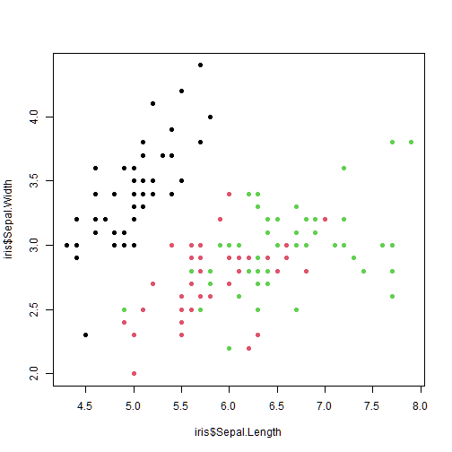

# The Basics {.chapter}

## Introduction

This template is based on the `pagedown::html_paged` template and modified to meet the requirements of a generic thesis document. Standard RMarkdown formatting can be used for smooth and distraction free writting, for example I will add a citation for the {knitr} package which is located in the `Thesis.bib` file auto-generated in this template [@R-knitr].

Thanks to the [help](https://github.com/rstudio/pagedown/issues/101) of [Romain Lesur](https://github.com/RLesur) this template has the ability to tag section headers with the word "Chapter ". To have your chapters display as this one (_Chapter 1 The Basics_) use the `{.chapter}` class like this:

_**rmarkdown**_
```markdown
---
output:
  pagedown::thesis_paged
    number_Sections: yes
---
# The Basics {.chapter}

## Introduction

This template is based on the `pagedown::html_paged` template...
```

## Second level heading

Here is some code and a plot, with a figure caption, Figure \@ref(fig:code):



Here is an example of an abbreviation where I use the `<abbr>` html tag <abbr title="Brent Thorne">BT</abbr>. In the future there may be a pandoc solution to abbreviation management, however <abbr title="Hyper Text Markup Language">HTML</abbr> is the way to go for now.

# Understanding the method to the madness {.chapter}

Need formulas? Here's some `mathjax` notation:

$$
\beta = \sum^{1 - k}\frac{\delta D}{\sum\frac{\Delta \gamma A}{X-i}}
$$

## Adding Tables

You can easily add tables to this document like so, and you can also reference them like a figure, Table \@ref(tab:atable):


Table: A caption for the table.

| Sepal L | Sepal W | Petal L | Petal W | Species |
|:-------:|:-------:|:-------:|:-------:|:-------:|
|   5.1   |   3.5   |   1.4   |   0.2   | setosa  |
|   4.9   |   3.0   |   1.4   |   0.2   | setosa  |
|   4.7   |   3.2   |   1.3   |   0.2   | setosa  |
|   4.6   |   3.1   |   1.5   |   0.2   | setosa  |

# The final chapter to my pretend thesis {.chapter}

There are still a few features that would be nice to implement in the future for this template. For instance:

1. It would be great to have the ability to use the [{redoc}](https://github.com/noamross/redoc) package to help those who have the ever dreaded "USE WORD ONLY" supervisors.

2. It would also be great to have the ability to generate a _Reference_ section for each _Chapter_ for those who are writing in the "integrated article" format.

3. Along with that, it would be great to pull the YAML data from a child .Rmd file and use it as a way to add the Chapter titles and any other subsequent information (for example a thesis chapter can often actually be a full manuscript and or published paper which would need to have all authors listed for that chapter specifically as well as the journal publication information/ citation data).

# References {-}


<!-- This '<div id="refs"></div>' needs to 
be here if you have appendix pages 
otherwise you can remove it.-->
<div id="refs"></div> 

# APPENDIX I {-}


| Sepal.Length | Sepal.Width | Petal.Length | Petal.Width | Species |
|:------------:|:-----------:|:------------:|:-----------:|:-------:|
|     5.1      |     3.5     |     1.4      |     0.2     | setosa  |
|     4.9      |     3.0     |     1.4      |     0.2     | setosa  |
|     4.7      |     3.2     |     1.3      |     0.2     | setosa  |
|     4.6      |     3.1     |     1.5      |     0.2     | setosa  |
|     5.0      |     3.6     |     1.4      |     0.2     | setosa  |
|     5.4      |     3.9     |     1.7      |     0.4     | setosa  |
|     4.6      |     3.4     |     1.4      |     0.3     | setosa  |
|     5.0      |     3.4     |     1.5      |     0.2     | setosa  |
|     4.4      |     2.9     |     1.4      |     0.2     | setosa  |
|     4.9      |     3.1     |     1.5      |     0.1     | setosa  |
