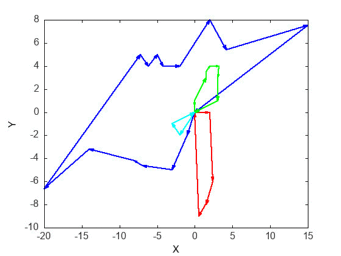
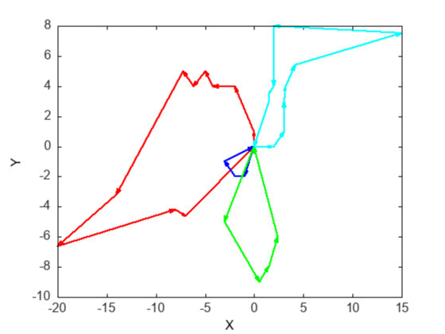

```{r setup, include=FALSE}
knitr::opts_chunk$set(echo = FALSE,
                      fig.align = 'center')
#require(magick)
library("jpeg")
require("R.utils")
library("animation")
```

```{r variablesetup, include=TRUE, echo=FALSE,results=FALSE}
imgdir_path<-Sys.getenv("rstudio_img")
imgdir<-imgdir_path[1]
if(imgdir=="")
{
  imgdir="../../tsp-build/img"
}
print(paste("IMG Directory:",imgdir))
outdir_path<-Sys.getenv("rstudio_out_img")
outdir<-outdir_path[1]
if(outdir=="")
{
  outdir="../../output/img"
}

print(paste("OUT Directory:",outdir))
imshow <- function(imgname)
{
  jj <- readJPEG(paste(imgdir,"/",imgname,sep=""),native=TRUE)
  par(mar=c(0,0,0,0),xaxs = 'i',yaxs='i')
  plot(0:1,0:1,type="n",ann=FALSE,axes=FALSE)
  rasterImage(jj,0,0,1,1) 
}
```

```{r tspgif,include=FALSE,fig.show='animate',interval=0.2,fig.width=8,                fig.height=6,fig.aligh='center'}
#print(paste("IMG Directory:",imgdir))
#for (i in 0:59)
#{
#  imshow(paste("greed_vs_opt2_",i,".jpg",sep=""))
#}
```

```{r,echo=FALSE,results='hide',message=FALSE,warning=FALSE}
loopMax = 30

saveGIF(
{
  for (i in 0:59)
 {
   imshow(paste("greed_vs_opt2_",i,".jpg",sep=""))
 }
},
movie.name = "greed_vs_opt2.gif", 
interval = 0.1, 
ani.width = 560, 
ani.height = 420,
)

saveGIF(
{
  for (i in 0:59)
 {
   imshow(paste("system_solved_opt2_route_",i,".jpg",sep=""))
 }
},
movie.name = "system_solved_opt2_route.gif", 
interval = 0.1, 
ani.width = 560, 
ani.height = 420,
)

saveGIF(
{
  for (i in 0:59)
 {
   imshow(paste("system_solved_greedy_route_",i,".jpg",sep=""))
 }
},
movie.name = "system_solved_greedy_route.gif", 
interval = 0.1, 
ani.width = 560, 
ani.height = 420,
)

saveGIF(
{
  for (i in 0:59)
 {
   imshow(paste("system_solved_opt2_route_prime_",i,".jpg",sep=""))
 }
},
movie.name = "system_solved_opt2_route_prime.gif", 
interval = 0.1, 
ani.width = 560, 
ani.height = 420,
)

saveGIF(
{
  for (i in 0:59)
 {
   imshow(paste("system_solved_greedy_route_prime_",i,".jpg",sep=""))
 }
},
movie.name = "system_solved_greedy_route_prime.gif", 
interval = 0.1, 
ani.width = 560, 
ani.height = 420,
)

saveGIF(
{
  for (i in 0:loopMax)
 {
   imshow(paste("sys_evo_",i,".jpg",sep=""))
 }
},
movie.name = "sys_evo.gif", 
interval = 0.5, 
ani.width = 560, 
ani.height = 420,
)

saveGIF(
{
  for (i in 0:loopMax)
 {
   imshow(paste("sys_evo_opt2",i,".jpg",sep=""))
 }
},
movie.name = "sys_evo.gif", 
interval = 0.5, 
ani.width = 560, 
ani.height = 420,
)
```
# Motivation {.chapter}

The travelling salesman problem (TSP), and in particular the generalization to the vehicle routing problem (VRP), are well-known NP-hard problems in optimization, with important applications to transport systems. Given that the transportation sector typically comprises a significant portion of GDP, any increase in solution optimization becomes significant. There are a number of heuristic approaches, but no optimal solutions yet. We investigate two of these heuristic methods, 2-opt and a naive greedy algorithm, to understand the strict/inhumane labor policies enacted on transportation drivers.

# Implementation {.chapter}

We implement all runtime code in C++17 with Matplot++ [@matplotplusplus], and documentation code in R [@R-animation;@R-jpeg;@R-knitr;@R-R.utils;@R-rmarkdown;@animation2013;@knitr2015,@knitr2014,@rmarkdown2018,@rmarkdown2020].
For simplicity, we are using the L2-norm metric (also called Euclidean distance), or colloquially, as the crow would fly. 

Note that this forces symmetrical distance, which is not necessarily the case for the VRP, as traffic, one-way streets and other considerations require directed graph solutions.

Note also that curvature of the Earth affects any realistic VRP, but we are assuming a flat planar surface of points (as required by the L2 metric).

Please note all "opt2" labels are equivalent to the 2-opt algorithm.

## The Greedy Algorithm

The naive greedy algorithm used here is the following heuristic:

Let $V$ be the set of delivery locations, and $\#(V)$ be the number of points in V.
Then the greedy tour is defined as the sequence $(p_n)$, where

$$
p_{n} = V_j \ \ s.t. \ \ d(p_{n-1},V_j) = min\{d(p_{n-1},V_i) \mid \forall \ i \in \mathbb{Z}^+, i < \#(V), p_n \notin \{p_1,p_2, \cdots p_{n-1} \}\},
$$
$\forall n\in \mathbb{Z}^+, n\leq \#(V)$.

Note that our implementation additionally does not include the endpoint in the set of points considered, since any delivery truck path has fixed start and endpoints.

A greedy test on the route (0,0),(0,5),(5,0),(5,5),(0,0) follows below.
(The red plot is the given route, and the greedy solution is in blue).

```{r}
imshow("greedy-test.jpg")
```

## The 2-opt Algorithm

We follow the below pseudocode as our implementation of 2-opt.

repeat until no improvement is made {<br>
&nbsp;&nbsp;&nbsp;&nbsp;best_distance = calculateTotalDistance(existing_route)<br>
&nbsp;&nbsp;&nbsp;&nbsp;start_again:<br>
&nbsp;&nbsp;&nbsp;&nbsp;for (i = 0; i <= number of nodes eligible to be swapped - 1; i++) {<br>
&nbsp;&nbsp;&nbsp;&nbsp;&nbsp;&nbsp;&nbsp;&nbsp;for (k = i + 1; k <= number of nodes eligible to be swapped; k++) {<br>
&nbsp;&nbsp;&nbsp;&nbsp;&nbsp;&nbsp;&nbsp;&nbsp;&nbsp;&nbsp;&nbsp;&nbsp;new_route = 2optSwap(existing_route, i, k)<br>
&nbsp;&nbsp;&nbsp;&nbsp;&nbsp;&nbsp;&nbsp;&nbsp;&nbsp;&nbsp;&nbsp;&nbsp;new_distance = calculateTotalDistance(new_route)<br>
&nbsp;&nbsp;&nbsp;&nbsp;&nbsp;&nbsp;&nbsp;&nbsp;&nbsp;&nbsp;&nbsp;&nbsp;if (new_distance < best_distance) {<br>
&nbsp;&nbsp;&nbsp;&nbsp;&nbsp;&nbsp;&nbsp;&nbsp;&nbsp;&nbsp;&nbsp;&nbsp;&nbsp;&nbsp;&nbsp;&nbsp;existing_route = new_route<br>
&nbsp;&nbsp;&nbsp;&nbsp;&nbsp;&nbsp;&nbsp;&nbsp;&nbsp;&nbsp;&nbsp;&nbsp;&nbsp;&nbsp;&nbsp;&nbsp;best_distance = new_distance<br>
&nbsp;&nbsp;&nbsp;&nbsp;&nbsp;&nbsp;&nbsp;&nbsp;&nbsp;&nbsp;&nbsp;&nbsp;&nbsp;&nbsp;&nbsp;&nbsp;goto start_again<br>
&nbsp;&nbsp;&nbsp;&nbsp;&nbsp;&nbsp;&nbsp;&nbsp;&nbsp;&nbsp;&nbsp;&nbsp;}<br>
&nbsp;&nbsp;&nbsp;&nbsp;&nbsp;&nbsp;&nbsp;&nbsp;}<br>
&nbsp;&nbsp;&nbsp;&nbsp;}<br>
}<br>

Our implementation again makes the following additional requirement that the start and endpoints of any path or tour are not changed.

Following are two 2-opt tests, one on the route (0,0),(0,5),(5,0),(5,5),(0,0) as previously, and another on a more complicated route, with red depicting the original route and blue the 2-opt result.

```{r}
imshow("2-opt-test_2.jpg")
imshow("2-opt-test.jpg")
```

# Single TSP Comparision

A list of 30 solutions to a small-sized graph using both the 2-opt and greedy methods to produce tours starting and ending at (0,0) is shown below.
We are using 30 solutions as that is the general value used to satisfy the central-limit-theorem from statistics, in the case of normality.

Note that the greedy heuristic does not change much with randomization of start position, while the 2-opt is much more flexible. We will later see that this flexibility can cause issues due to generation of variance, as per the bias-variance tradeoff.


## Runtime Complexity

From code analysis, we see that the runtime complexity is as follows:

We have a reverse_route method of $O(n)$,and call that method for all m<n options. So we have approximately $n^2/2$ calls to reverse_route, at minimum,and approximately $n^3/2$ calls at maximum (due to the while loop). We also have a comparison and copy call, the comparison	being of order $2n$ and the (sometimes called) copy of order $n$. 
So we have that the time complexity is bounded between $O(n^3)$ and $O(n^4)$:
$$
O(n^2/2) * O(n+n+2n) \leq TC \leq O(n^2/2) *x* O(n+n+2n) \implies O(n^3) \leq TC \leq O(n^4), 
$$
			 
			which is pretty bad. 
Note the memory complexity is clearly $O(n)$. Comparing to the greedy method, that has a runtime complexity of under $O(n^3)$, as implemented, and may even be of $O(n^2 log n)$, as is mentioned in literature.

## Circuit Length and Algorithm Time Comparision

Plotting the length of the solutions shown above, we see as below that 2-opt performs, on average, much better than the greedy algorithm, as the 2-opt mean tour length is 8-units less than that of the greedy algorithm. 
(The 2-opt histogram is in blue, while the greedy histogram is in orange.)
While the plots are clearly not normally distributed, and a rigorous fit and hypothesis test has not been done, we can somewhat see that the difference between 2-opt and the greedy algorithm is statistically significant.

```{r}
imshow("greed_vs_opt2_hist.jpg")
```
Unsurprisingly, we see that the greedy algorithm outperforms 2-opt in speed, as it is atleast an order of magnitude faster than the 2-opt algorithm (in the below plot). The 2-opt distribution may seem to be right-skewed, with some dangerously-long solutions (in terms of computation time), but that is an outlier as can be seen in later plots.

```{r}
imshow("greed_vs_opt2_histT.jpg")
```
This scatter plot shows that the 2-opt algorithm is really just normally distributed around 2.5 milliseconds computation time and 50-units tour length, while the greedy algorithm is much faster at a few microseconds, and much longer at around 58-units tour length.

```{r}
imshow("greed_vs_opt2_LT.jpg")
```
We will now proceed to a Multiple VRP analysis.

# Multiple VRP

## Paths with Differing Start and End Points

To validate our later cycle-graph-based 2-opt and greedy implementations, the following plots comprise a test of the 2-opt and greedy algorithms applied to a 3-vehicle VRP.

The plots are as follows: the original system, the greedy solution, and then the 2-opt solution.

```{r}
imshow("system.jpg")
imshow("system_solved_greedy.jpg")
imshow("system_solved_opt2.jpg")
```

We can see that both algorithms perform as expected.

## Distribution Center Tours / Cycle-Graph Decompositions

We will now model the VRP as having a single distribution center, from which 3 vehicles
follow cycles that comprise the entire graph.

As before, we show 30 solutions to the same graph with randomized input order below, with the greedy solution first, and then the 2-opt solution.
 
 

The summary plot below again shows results similar to the Single-TSP case, but now we can see the time-based right skew in the 2-opt distribution.

```{r}
imshow("greed_vs_opt2_M_LT.JPG")
```

## Amazon Prime / Fixed vertices

If we now have fixed vertices in the graph that cannot be swapped between different vehicle routes, we reach a more realistic scenario. We will call these fixed vertices as <i>prime vertices</i>, since they can model Prime delivery as in the case of Amazon Prime.

Below are 90 plots of a randomized delivery itinerary (as before), with differing levels of prime vertices (as before, the first plot is the greedy solution, while the second plot is the 2-opt solution).

 

We can see that as we add prime vertices into the graph, the tours become more complicated and begin to cross-over each other. While the 2-opt tours are better, they rely on a single driver completing most of the deliveries; a horrible solution with respect to the drivers.

The summary plots below show that as the number of prime addresses increase, the 2-opt method gains advantage over the greedy algorithm, as it still produces shorter overall systems, and actually decreases in computation time.

```{r}
imshow("greed_vs_opt2_M_LT_prime.jpg")
imshow("greed_vs_opt2_M_L_prime.jpg")
imshow("greed_vs_opt2_M_T_prime.jpg")
```
Unfortunately, while 2-opt improves profit by decreasing graph length, it increases inequality of workload, as seen in the above set of plots, by assigning a large workload to a single driver. 
In some cases, this may even produce intractable solutions, where the driver cannot complete their workload inside the required timeframe.

One way to fix this may be to limit or cap the maximum drive time by treating the individual cycles as simultaneously running vehicles, but that will fail when we add in evolving systems (as the list of deliveries change over time, there is no good definition of such a maximum drive time).

In evolving systems, we can see a common problem that is currently experienced by transportation workers.
None of the above analysis takes traffic and directional distance into account. Assuming that this is done, there are still other issues such as restroom and off-time breaks for the drivers. These breaks may not necessarily fit into the route, as most traffic spikes/restroom breaks occur at random times throughout the day. So even if we can define a maximum drive time cap, for example: all of a sudden, due to a particularly bad traffic accident, the shortest route A is now the longest time route, and the longest route B can be completed in half the time. So even if a new, optimal set of routes can be generated immediately, the route A driver still needs to deliver to the same destinations as before, unless the route A driver can give some packages to another driver (which requires an intersection between routes, and additional time delay so the drivers can meet).

Even if all the breaks/other issues are considered, any new delivery order will create an equivalent issue, as seen below.


---- add part 9 here


# Conclusion and Ethics

So we see that the VRP problem, by definition, generates inhumane work conditions for vehicle drivers.
Any naive solution attempt can be seen to follow similar behavior as described above, whereby one or a few drivers must rush to complete their deliveries, sometimes with no prior notice. This constraint induces the common behavior of not taking breaks, in an effort to build up some extra time to be used when necessary, and leads to the often discussed issues: drivers going over the speed limit, not taking proper restroom breaks, ... and similar.

We will not make any attempt to discuss potential solutions to this quandary, as not enough research in that area has been done here. We will notice that by introducing new metrics (measurable quantities), there may exist yet undiscovered heuristics that minimize these conditions. It is also possible, though this is beyond the scope of this paper, that no heuristic can sufficiently bound drivetime so as to be humane, unless some other real-world constraint is relaxed.

# Acknowledgements
My parents, for providing assistance with code debugging, providing valuable feedback on paper aesthetics, and uncountably many other things.

Dr.Eijkhout, for providing an interesting assignment, and a detailed walkthrough of the TSP problem.

Dr.Eijkhout and Dr.Lindsey, for such an interesting course!

# References {.unnumbered}

```{r, include=FALSE}
#knitr::write_bib(c('knitr', 'rmarkdown', 'jpeg', 'R.utils', 'animation'), 'packages.bib')
```

```{=html}
<!-- This '<div id="refs"></div>' needs to 
be here if you have appendix pages 
otherwise you can remove it.-->
```
::: {#refs}
:::

# (APPENDIX) Appendix {-}
To see the exercises completed as given in Ch.59 of Dr. Eijkhout's Intro to Scientific Programming textbook, please see the terminal output of the attached executable.

Thank you so much for reading this work!
